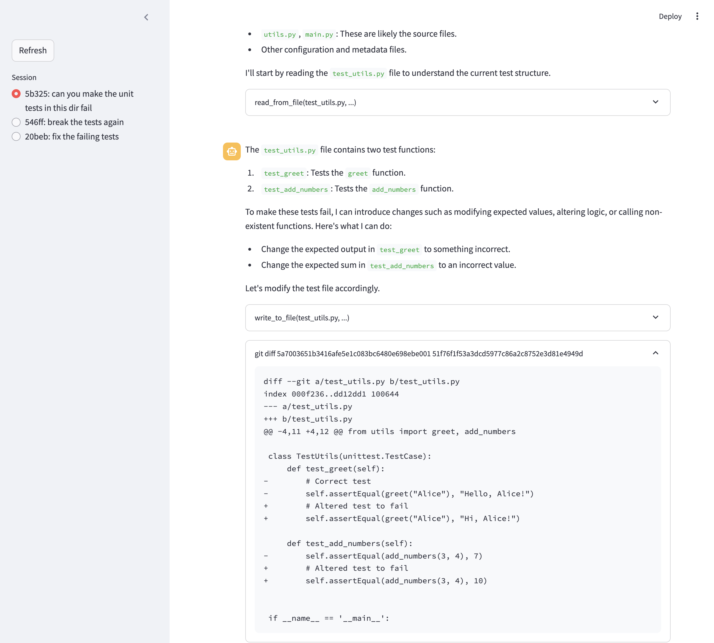

# programmer

programmer is a command-line based AI programmer, that will help you get stuff done.

programmer has direct access to your machine, it can run commands, and read and write files, without safety checks. You have been warned!


## Quickstart

```
pip install programmer
programmer 
```

## Examples

- "What processes are listening on port 4512?" ... "ok, please kill them"
- "What's in frog.jpg?"
- "Write a function to determine if a tic-tac-toe game is won in a file called tictactoe.py. also write unit tests, and iterate until they pass."
- "Fix all the type errors in this project"


## Usage

Just

```
programmer
```

Alternatively:
```
programmer prompt <initial_prompt>
```

To resume from an earlier state:
```
programmer --state <state_ref>
```

## Tracking

Programmer is designed to get better over time. For that we need to track trajectories, identify good and bad ones to add to Evaluations (like unit tests for AI), and then iterate on programmer's prompts and architecture to improve against the Evaluations.

By default all trajectories are logged to `.programmer/weave.db`. You can turn on cloud logging with `programmer settings set weave_logging cloud`. Trajectories will be saved to Weave at wandb.ai

You can turn on git tracking with `programmer settings set git_tracking on` to get programmer to track all of its work in "programmer-*" branches. Each git state will be associated with the Weave trajectories, and you can browse the diffs with `programmer ui`

## UI

Run

```
programmer ui
```

to run the local streamlit UI. This should work with either weave_logging:cloud or weave_logging:local, but there are some bugs with local mode at the moment.



# Weave UI 

When weave_logging is set to "cloud" you can use the Weave UI at wandb.ai to browse traces.

## Settings

Settings are stored in .programmer/settings

programmer settings set weave_logging <value>
  - off: no logging
  - local: log to local sqlite db
  - cloudd: log to weave cloud at wandb.ai

programmer settings set git_tracking <value>
  - off: no git tracking
  - on: programmer with make programmer-* branches and track changes

## Improving programmer

programmer is designed to be improved using [weave](https://wandb.me/weave), our toolkit for AI application development. What does this mean?

- you can browse traces and evals in the Weave UI at https://wandb.ai
- programmer can resume from earlier states, with the --state argument
- programmer will log all of your interactions to a local sqlite database, or the central Weave service.
- This data can be used to improve programmer over time, by building Evaluations, fine-tuning, and other techniques.

To run the evaluation:

```
python evaluate.py
```

## roadmap

- [x] weave server tracking
- [x] git state tracking
- [x] basic trajectory UI
- [ ] user-annotation of good and bad behaviors
- [ ] eval generation